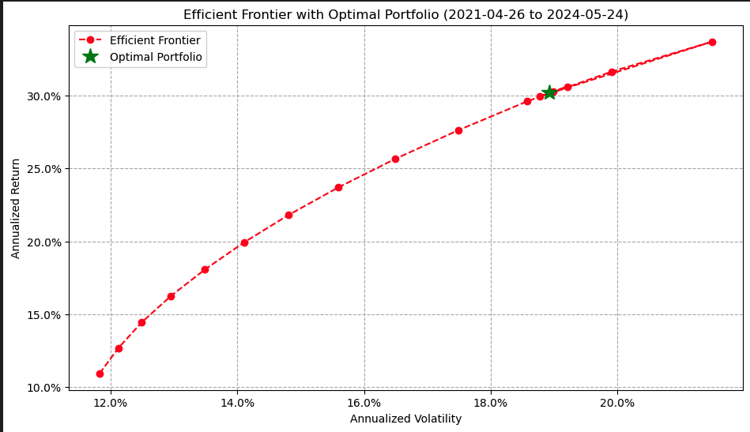

# PROJECT TITLE 

## NON-TECHNICAL EXPLANATION OF YOUR PROJECT
This project implements Modern Portfolio Theory, a framework for constructing an optimal investment portfolio by balancing risk and return. It analyzes historical stock data to identify the most efficient combination of assets that maximizes expected returns for a given level of risk tolerance. The project provides insights into portfolio diversification, asset allocation strategies, and investment decision-making.

## DATA
The project utilizes historical stock price data obtained from the uk.investing.com website. The dataset includes daily price information, such as open, high, low, close, and trading volume, for companies listed on the FTSE 100 index. Additionally, it incorporates data for the FTSE 100 index itself and the United Kingdom 3-month and 6-month bond yields, serving as proxies for market performance and risk-free rates, respectively. The data covers the time period from April 26, 2021, to May 24, 2024.

## MODEL 
The project employs the Markowitz model, a foundational framework in Modern Portfolio Theory. This model aims to construct an optimal portfolio by considering the expected returns, risks (measured by variance or standard deviation), and covariances of the individual assets. The optimization process involves minimizing portfolio variance subject to constraints such as budget, non-negativity, and return requirements. The resulting efficient frontier represents the set of optimal portfolios offering the highest expected return for a given level of risk.

## HYPERPARAMETER OPTIMSATION
The project does not explicitly involve hyperparameter optimization, as the Markowitz model is a mathematical optimization problem rather than a machine learning model. However, the project explores various target return levels (r_bar) and generates multiple efficient frontier points corresponding to different risk-return trade-offs. These target return levels can be considered as parameters that influence the optimization process and the resulting portfolio allocations.

## RESULTS
The project generates an efficient frontier plot, which visualizes the optimal portfolios and their corresponding risk-return characteristics. It also provides the asset allocation weights for each portfolio on the efficient frontier, allowing investors to choose their desired level of risk and expected return. Additionally, the project identifies the portfolio with the maximum Sharpe ratio, representing the optimal trade-off between risk and return. The results are further validated through backtesting on historical data, which evaluates the performance of the optimized portfolios using metrics such as annualized returns, volatility, Sharpe ratios, and maximum drawdowns.

## (OPTIONAL: CONTACT DETAILS)
For any further inquiries or collaborations, please feel free to reach out to me at eugenecoelho@gmail.com
